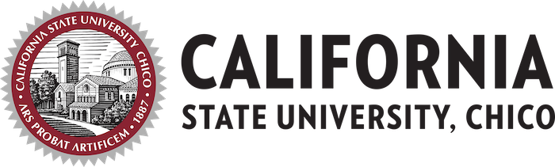
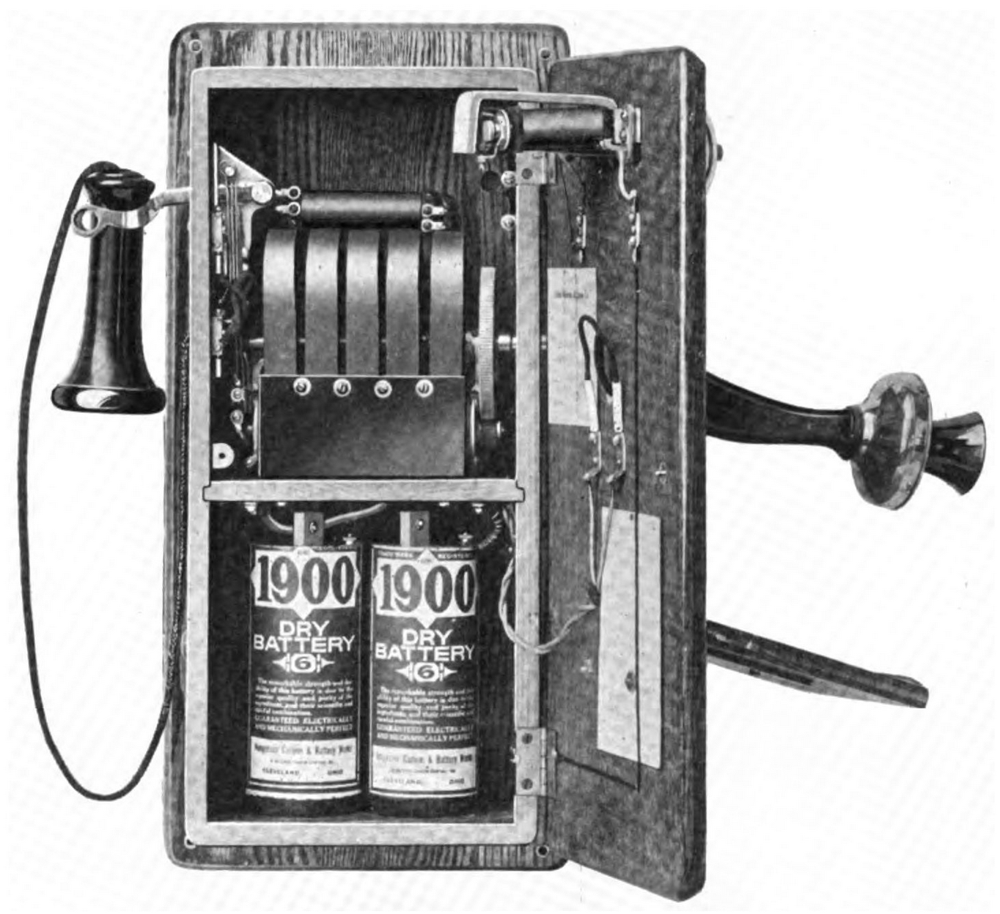
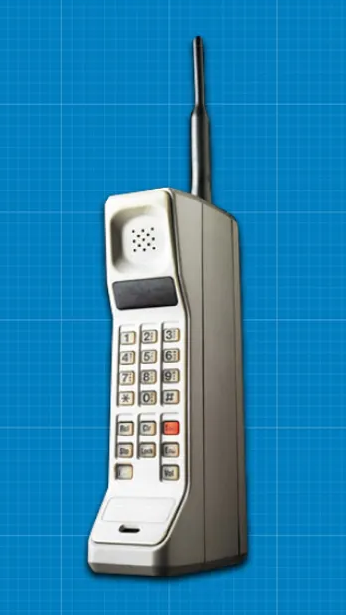
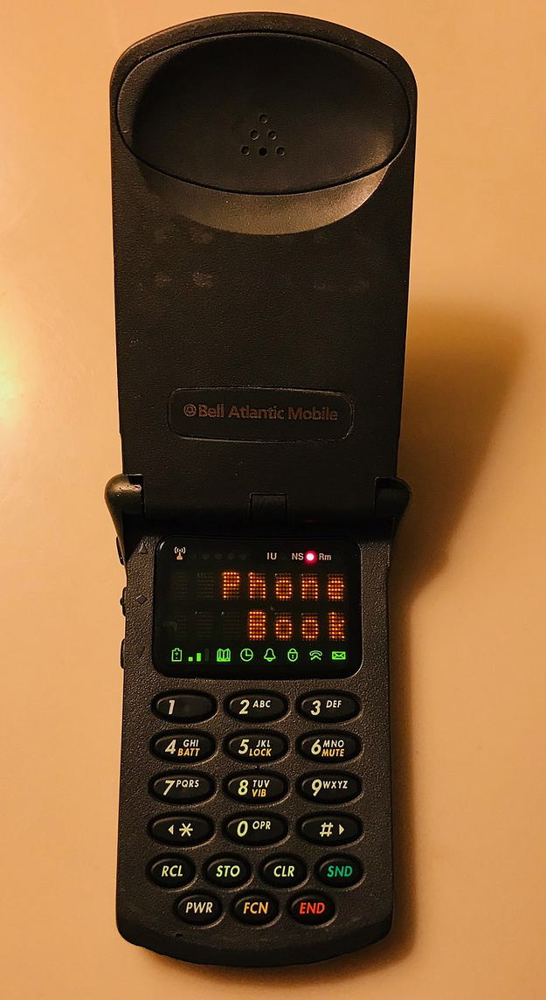
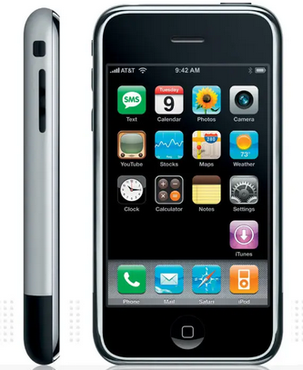
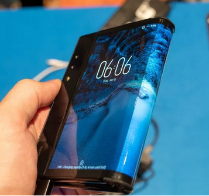
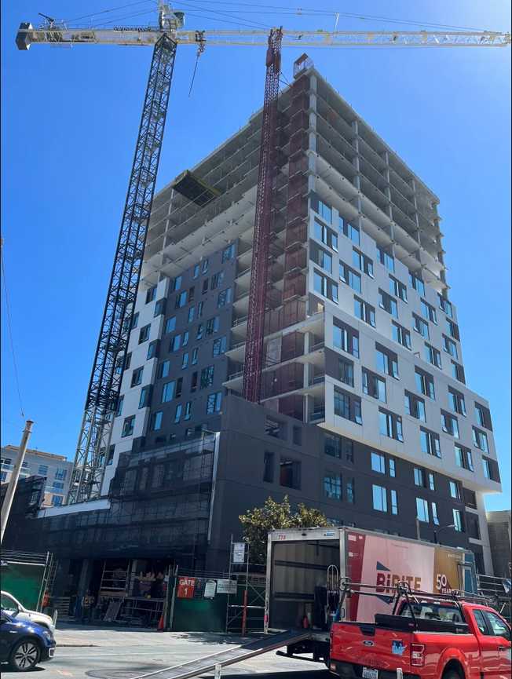

# MADT307 Fall 2022
## Toto Albano-Dito | Blogs

------------------------------------------------------------------------------------------------------
### Assignment #4 - Group Rules
9/16/2022

#### Kickstart Team 3: 
Toto Albano-Dito,
Karamvir Janda,
Aviana Loveall,
Anthony Rincon

#### Meeting times: 

- Tuesdays & Thursdays 6-9 pm

Communication:

- Discord / zoom / in-person

- File sharing on google drive 

#### Guidelines / Rules:

- Everyone participates within the meetings when communicating work contribution
- If a member is unable to participate for any reason, said member must at least inform the group of the absence 
- We will try to meet at least 2 times a week around night (times are flexible)
- Contributions will be evenly distributed throughout the semester, if someone cannot fully participate for one assignment, they can make it up on the next one
- Communication is most important, if you CANNOT participate for a moment, please communicate this to the group
- WARNING failing to communicate with the team why you aren't participating will result in name crossed out of assignments and continuation will lead to kick from group

#### General Topic: A Skill-Share Like website/app

- Kick Start an internet website where people can learn and  remotely from home 
- People can share their knowledge to others through the internet 
- Exploring remote learning technologies 

------------------------------------------------------------------------------------------------------
### Assignment #3 - Kickstart Start
9/09/2022

Remote learning and working technology have had a significant impact on our society that we haven’t seen before in human history till now. It interests me because before technological advances the only way to learn something without the help of others is through books. Now at the time not everyone could read, books were limited, and it was most likely difficult to find the exact book you need let alone if the information was accurate or not. Now because of the availability of the internet, all sources on anything you want is literally at your fingertips. They way people properly learn was through others and more so in person. But with the use of internet people are able to educate each other remotely as we are now all digitally connected. Learning has also in ways became easier, when we compare lecturing to creative videos, podcasts, websites etc. learning has become more than just audio learning, but a visual experience with the creativeness a computer and internet offers. We even see since the covid pandemic classrooms don’t necessarily have to be in person, an impossible foot before the use of internet. Now classrooms can be filled virtually through a computer.

This technology hasn't only affected the classroom but work as well. Again, since the pandemic work was something, you go to not something you had the luxury to be at home for. But since work for primarily white-collar labor was in the office, people released while stuck at home that the home could be just as productive or potentially more for some at home. The indirect effect was the damage to office culture, as we see across the states many offices remain vacant despite people return to work after the pandemic. Something interesting would be examining the indirect effects of this. We see how the office culture was effected but will it dramatically effort school culture as well?

------------------------------------------------------------------------------------------------------
### Assignment #2 - History in Pictures
9/4/2022

1. Wall phone which rewquired its own battery for power 1917

link: https://commons.wikimedia.org/wiki/File:Magneto_wall_telephone_1917_open.jpg

2. First Hnadheld Phone Motorola DynaTAC 8000X 1983

Link: https://interestingengineering.com/innovation/the-history-behind-the-invention-of-the-first-cell-phone

3. First Flip Phone Motorola StarTAC 1996

https://en.wikipedia.org/wiki/Motorola_StarTAC

4. First mainstream smart phone, IPhone 1 2007

https://www.computerworld.com/article/2604020/the-evolution-of-apples-iphone.html#slide2

5. First foldable smartphone Royole FlexPai 2018

https://www.androidcentral.com/brief-history-folding-phone

------------------------------------------------------------------------------------------------------
### Assignment #1 - About Me
8/25/2022

Twitter: @ForSchoolYo

My name is Toto but everyone calls me Graziano and yes it is Italian. Both sides of my of my family originated from southern Italy and my grandparents migrated to the US and settled in San Francisco. I grew up in the Bay Area and after high school attended a local junior college for four years. after which I transferred to Chico to finish my studies for a BS in Mechanical Engineering. I am in my senior year and excited to have gotten this far with difficult degree and I'm glad to finally see the finish line coming soon. for the summer I interned for a General Contractor in San Francisco in which I joined a project team assigned to the management and construction of a 20 story affordable living high-rise building in the middle of Soma. It was a great summer and I'm heavily considering working with the company in the future.

